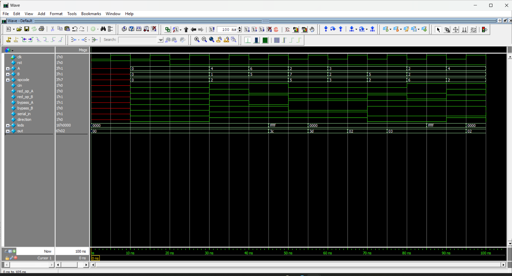

# ALSU-RTL-and-UVM-Verification

**A parameterized Arithmetic Logic Shift Unit (ALSU) with a complete UVM-based verification environment.**

[](./LICENSE)

---

## Project summary

This repository contains a configurable ALSU (Arithmetic Logic Shift Unit) RTL implementation (Verilog) and a full SystemVerilog UVM verification environment. The verification environment includes constrained-random tests, directed tests, functional coverage collection, and a scoreboard-based checker. Coverage reports are included in `coverage_rpt.txt`.

Key features:

* Logical operations (AND, OR, XOR) with optional reduction.
* Arithmetic operations (ADD with configurable full-adder mode, MULT).
* Shift and rotate operations (left/right, configurable direction).
* Input bypass modes and priority selection between inputs.
* UVM environment: sequences, driver, monitor, scoreboard, and coverage collectors.

---

## Repository layout

```
ALSU-RTL-and-UVM-Verification/
├── rtl/                  # RTL design (ALSU.v)
├── verification/         # UVM environment and SV classes
│   ├── alsu_pkg.sv
│   ├── config.sv
│   ├── driver.sv
│   ├── env.sv
│   ├── seq.sv
│   ├── test.sv
│   ├── coverage.sv
│   ├── interface.sv
│   ├──top.sv
│   ├──top.sv
│   └──assertions.sv
├── testbench/            # Simple testbench for waveform/debug (alsu_tb.sv)
├── sim/                  # Simulation scripts (run.do)
├── coverage_rpt.txt      # Coverage output 
├──images/                # Wave.png
└── LICENSE
```

> Note: filenames in the repo currently include a small typo (`driver;.sv`) — rename it to `driver.sv` to avoid simulator errors.

---

## Requirements

* A SystemVerilog-capable simulator (QuestaSim, VCS, Xcelium, etc.).
* For running UVM tests, an installation with UVM library available or added to the simulator search path.

---

## How to run (QuestaSim example)

1. Clone the repo:

```bash
git clone https://github.com/Eng-AbdallahSabah/ALSU-RTL-and-UVM-Verification.git
cd ALSU-RTL-and-UVM-Verification
```

2. Open the `sim/run.do` script in QuestaSim and adapt library paths if necessary.

3. From QuestaSim command line:

```
vsim -c -do "run -all" -sv_seed random_seed work.top
```

Or use the included `run.do`:

```
vsim -do sim/run.do
```

4. After simulation finishes, check `coverage_rpt.txt` and the `coverage` files generated by your simulator.


---


## 📊 Simulation Waveform

Below is a waveform captured using **QuestaSim**, showing the write and read operations on the RAM.  
The simulation confirms correct memory behavior across different clock cycles.



---

## Suggested improvements (what I changed in this README & what you should apply to the repo)

1. **Fix typos and filenames**

   * Rename `driver;.sv` → `driver.sv`.
   * Ensure all `.sv` files use consistent encoding (UTF-8) and correct module/file headers.

2. **Organize folders**

   * Move RTL modules into `rtl/` (if not already).
   * Move verification code into `verification/` and testbench into `testbench/`.

3. **Improve README with concrete commands** (done here).

4. **Add a CONTRIBUTING.md and ISSUE\_TEMPLATE**

   * Provide instructions for how to run tests, how to submit bugs, and coding style expectations.

5. **Add CI (optional)**

   * Add GitHub Actions to run linting and (if possible) run a lightweight simulation (e.g., using iverilog for basic smoke tests). For full UVM simulation you will need a licensed simulator, which cannot run in GitHub-hosted runners.

6. **Add a clear `Makefile` or top-level `run.sh`**

   * Provide simple commands: `make sim`, `make clean`, `make coverage` to help users reproduce results.

7. **Add example waveform screenshots and sample commands to reproduce them**

   * Keep `Screenshot 2025-09-01 010450.png`, but also add smaller images or GIFs that show the simulation waveforms.

8. **Add contact and citation**

   * How to reach you (email) and a short note about the author and university/project affiliation.

---

## Contributing

Contributions are welcome. Please open an issue for bugs or feature requests, then create a pull request with a clear description of changes and test results.

---

## License

This project is released under the MIT License. See `LICENSE` for details.

---

## Contact

Repository owner: Eng-AbdallahSabah

If you want, I can:

* create a `CONTRIBUTING.md` and `Makefile` and open a PR-ready patch for you, or
* update the repository structure and fix the filename typo and push a commit (if you give me access or provide a patch), or
* generate a GitHub Actions workflow template that runs smoke checks.

Tell me which of the above you'd like me to do next and I'll prepare the needed files.
